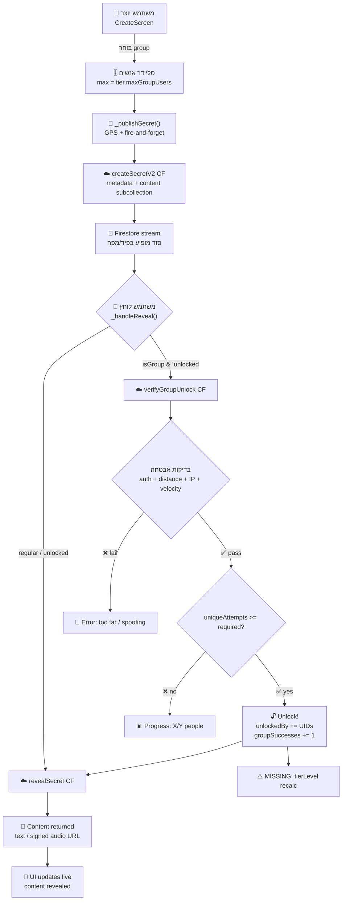

# ניתוח מלא: האש קבוצתי (Group Hush) ומערכת הדרגות (Tiers)

---

## חלק א׳ — הסבר בעברית פשוטה למשתמש קצה 🇮🇱

### מה זה "האש קבוצתי"?

האש קבוצתי הוא סוד שמישהו מטמין (מפרסם) במיקום מסוים, אבל **לא מספיק שתגיע אליו לבד כדי לפתוח אותו** — צריך שמספר מסוים של אנשים שונים יגיעו **לאותו מיקום** ויבקשו לפתוח אותו **באותו חלון זמן**.

#### דוגמה פשוטה:
> שרה מטמינה האש קבוצתי בכיכר העיר.
> היא מגדירה שצריך 5 אנשים תוך 3 דקות.
> כדי שהסוד ייפתח — 5 אנשים שונים צריכים להיות בטווח של הסוד ולהקיש עליו **תוך 3 דקות זה מזה**.
> ברגע שהאדם ה-5 לוחץ — הסוד נפתח לכולם!

---

### מה זה "דרגות" (Tiers)?

כל משתמש באפליקציה מתחיל בדרגה 1 (ברירת מחדל, צבע אפור). ככל שהוא **מצליח יותר בהאש קבוצתי** — הוא עולה בדרגות.

> [!IMPORTANT]
> **עליה בדרגות מתבססת על כמות ההצלחות** — כלומר כמה פעמים האש קבוצתי שלך נפתח בהצלחה על ידי מספיק אנשים.

#### טבלת הדרגות:

| דרגה | שם | צבע | הצלחות נדרשות | מקסימום אנשים | חלון זמן (דקות) | טווח גילוי (מ׳) |
|------|-----------|------|---------------|---------------|-----------------|-----------------|
| 1 | Default | ⬜ אפור | 0 | 3 | 1 | 15 |
| 2 | Novice | 🟦 כחול | 5 | 8 | 2 | 15 |
| 3 | Apprentice| 🟩 ירוק | 10 | 15 | 3 | 15 |
| 4 | Adept | 🟨 צהוב | 15 | 25 | 4 | 15 |
| 5 | Expert | 🟧 כתום | 20 | 40 | 5 | 30 |
| 6 | Master | 🟥 אדום | 25 | 70 | 6 | 40 |
| 7 | Grandmaster|🟪 סגול | 30 | 120 | 8 | 60 |
| 8 | Legend | 💗 ורוד | 35 | 200 | 10 | 80 |
| 9 | Mythic | 🩵 ציאן | 40 | 350 | 12 | 100 |
| 10 | God Tier | 🥇 זהב | 50 | 500 | 15 | 150 |

#### מה קורה כשעולים בדרגה?

1. **יותר אנשים** — אפשר ליצור האש קבוצתי שדורש יותר אנשים (3 → עד 500)
2. **יותר זמן** — חלון הזמן שבו האנשים צריכים להגיע גדל (1 דקה → 15 דקות)
3. **טווח גילוי גדול יותר** — בדרגות גבוהות, האש קבוצתי שלך נראה ממרחק גדול יותר (15 מ׳ → 150 מ׳)
4. **צבע ייחודי** — הדרגה שלך מופיעה ליד השם שלך בכל סוד שאתה מפרסם, וכרטיס הסוד זוהר בצבע הדרגה שלך

#### איך בדיוק עולים?

**כל פעם שהאש קבוצתי שלך נפתח בהצלחה** (מספיק אנשים שונים הגיעו לטווח ולחצו בחלון הזמן) — המערכת סופרת לך +1 הצלחה. כשמגיעים לרף ההצלחות של הדרגה הבאה — עולים אוטומטית.

#### איך זה נראה באפליקציה?

- **בפרופיל** — מוצגת תווית צבעונית עם מספר הדרגה (לדוגמה: "Tier 5" בכתום)
- **בכרטיס סוד** — העיגול סביב תמונת המשתמש זוהר בצבע הדרגה, והכרטיס כולו עוטף ב-glow עדין באותו צבע
- **ביצירת האש קבוצתי** — הסליידר מאפשר לבחור כמות אנשים עד למקסימום שהדרגה מאפשרת, וחלון הזמן נקבע אוטומטית לפי הדרגה

---

### המסע המלא: מיצירת האש קבוצתי ועד לפתיחה שלו

```
😊 שרה (Tier 3, ירוקה)
  │
  ▼
📱 נכנסת למסך "יצירה" (Create)
  │
  ▼
🎤 מקליטה הודעה קולית (או כותבת טקסט)
  │
  ▼
🔘 בוחרת "סוד קבוצתי" (Group Secret)
  │
  ▼
🎚️ סליידר: בוחרת 10 אנשים (Tier 3 מאפשר עד 15)
   ⏱️ חלון זמן: 3 דקות (נקבע אוטומטית ע"י הדרגה)
  │
  ▼
📍 לוחצת "הטמן סוד" → GPS נקלט + הסוד נשלח לשרת
  │
  ▼
☁️ השרת שומר את הסוד ב-Firestore:
   • המטא-דאטה (מיקום, יוצר, דרגה, צבע) → מסמך ראשי
   • התוכן (טקסט/שמע) → תת-אוסף מוגן (content/data)
   • לא ניתן לקרוא תוכן ישירות!
  │
  ▼
🗺️ הסוד מופיע בפיד ובמפה לכל מי שנמצא בטווח 500 מ׳
  │
  ▼
👤 דני רואה את הסוד בפיד (כרטיס עם עשן + סמל מנעול)
   רואה: "סוד קבוצתי" + "נדרשים: 10 אנשים"
  │
  ▼
👆 דני לוחץ על הכרטיס ← מפעיל verifyGroupUnlock
  │
  ▼
☁️ השרת בודק:
   ✅ דני מחובר (authenticated)?
   ✅ דני בטווח הגילוי (ל-Tier 3: 15 מ׳)?
   ✅ לא מהיר מדי (velocity check)?
   ✅ IP ייחודי (לא אותו טלפון)?
   ❌ רק 1 מתוך 10 — עוד 9 אנשים חסרים!
  │
  ▼
📊 דני רואה: "עוד 9 אנשים נדרשים"
   מונה בזמן אמת מתעדכן: "1 / 10 אנשים"
  │
  ▼
👥 עוד 9 אנשים מגיעים פיזית ולוחצים תוך 3 דקות...
  │
  ▼
☁️ השרת בודק: 10 ≥ 10 ✅ → הסוד נפתח!
   • unlockedBy מתעדכן עם כל ה-UIDs
   • groupSuccesses של שרה (היוצרת) עולה ב-1
   • כולם יכולים עכשיו לקרוא את התוכן
  │
  ▼
🔓 הכרטיס מתעדכן חי (Firestore stream):
   • העשן נעלם ← התוכן מופיע (טקסט/נגן שמע)
   • לייק / דיסלייק / תגובות — זמינים
   • אפשר לשמור (Save) — מעניק "חסינות" מפני Decay
```

---

## חלק ב׳ — ניתוח טכני מפורט של שרשרת הפעולות

### 1. יצירת האש קבוצתי (Create Flow)

**קובץ:** [`create_screen.dart`](file:///c:/Dev/hush-app/lib/screens/create_screen.dart)

שרשרת הפעולות:

1. **בחירת סוג סוד** (שורה 41, 396-447):
   - `_secretType = 'group'` → מציג UI נוסף: סליידר + חלון זמן
   - הסליידר מוגבל ע"י `currentTier.maxGroupUsers` (שורה 417)
   - חלון הזמן נקבע אוטומטית: `currentTier.timeWindowMinutes` (שורה 209)

2. **קריאת דרגת המשתמש** (שורה 196):
   ```dart
   final tierLevel = context.read<AuthProvider>().hushUser?.tierLevel ?? 1;
   ```

3. **שליחה — `_publishSecret()`** (שורה 193-253):
   - קורא מיקום GPS (מ-`_lastPosition` או Geolocator)
   - מנווט ישר לפיד (fire-and-forget)
   - קורא ל-`_publishInBackground()` → `SecretService.createTextSecret()` / `createVoiceSecret()`

4. **Cloud Function — `createSecretV2`** (שורה 895-985 ב-[`index.ts`](file:///c:/Dev/hush-app/functions/src/index.ts)):
   - בודק rate limit (5 יצירות לדקה)
   - קורא פרופיל יוצר (שם, תמונה, דרגה, צבע)
   - יוצר מסמך ב-`secrets/` **ללא תוכן** (metadata only)
   - שומר תוכן ב-`secrets/{id}/content/data` (subcollection מוגן)
   - מעלה `totalPublished` ב-1

---

### 2. הצגת האש קבוצתי בפיד (Display Flow)

**קובץ:** [`secret_card.dart`](file:///c:/Dev/hush-app/lib/widgets/secret_card.dart)

1. **initState** (שורה 80-131):
   - מתחבר ל-**stream חי** של מסמך הסוד (`getSecretStream`)
   - אם האש קבוצתי → מתחבר גם ל-**stream מונה משתתפים** (`getUnlockAttemptsStream`)
   - אם המשתמש כבר ב-`unlockedBy` או יוצר/שומר → מפעיל `_fetchContentFromServer()` אוטומטית

2. **חישוב טווח** (שורה 770-783):
   ```dart
   final double effectiveRadius = _currentSecret.isGroup
       ? tier.revealRadius   // ← תלוי דרגה! 15-150m
       : AppConstants.revealRadiusMeters; // ← תמיד 15m
   isInRange = distance <= effectiveRadius;
   ```

3. **UI מצב לא-נפתח** (שורה 1302-1339 — `_buildTapToReveal`):
   - מציג אייקון קבוצה (`HushIcons.users`)
   - מציג מונה: `"3 / 10 אנשים נדרשים"`
   - מתעדכן בזמן אמת מה-stream

4. **UI מצב חסום** (שורה 1121-1228 — `_buildContent` כאשר `!isInRange`):
   - טקסטורת עשן מעורפלת + blur
   - סמל מנעול + טקסט "A secret is ready for you"
   - מצפן חי שמכוון לכיוון הסוד

---

### 3. ניסיון פתיחה (Unlock Attempt Flow)

**קובץ:** [`secret_card.dart`](file:///c:/Dev/hush-app/lib/widgets/secret_card.dart) — `_handleReveal()` (שורה 234-329)

1. **בדיקות לוקאליות:**
   - האם יש `userPosition`?
   - האם זה `isGroup` ואני לא ב-`unlockedBy`?

2. **פידבק מיידי** (שורה 249-269):
   - מציג snackbar עם מונה לוקאלי (טרם תגובת שרת)

3. **קריאה לשרת:**
   ```dart
   final result = await _secretService.verifyGroupUnlock(
     secretId: _currentSecret.id,
     lat: widget.userPosition!.latitude,
     lng: widget.userPosition!.longitude,
   );
   ```

4. **Cloud Function — `verifyGroupUnlock`** (שורה 617-739 ב-[`index.ts`](file:///c:/Dev/hush-app/functions/src/index.ts)):

   בדיקות אבטחה:
   - ✅ authenticated
   - ✅ rate limit (10 לדקה)
   - ✅ velocity check (מהירות < 300 קמ"ש — מונע GPS spoof)
   - ✅ distance check (Haversine) — חייב להיות בתוך `revealRadius` של הדרגה
   - ✅ IP uniqueness — מונע מכשיר אחד עם חשבונות רבים

   לוגיקה:
   ```
   1. רושם את הניסיון ב-unlockAttempts/{uid}
   2. שולף את כל הניסיונות ב-timeWindow (נניח 3 דקות אחרונות)
   3. מסנן לפי IP ייחודי (כתובת רשת)
   4. אם uniqueAttempts >= requiredUsers:
      → מעדכן unlockedBy (מערך של כל ה-UIDs)
      → groupSuccesses של היוצר += 1
      → מחזיר success: true
   5. אחרת → מחזיר success: false + currentCount + requiredCount
   ```

5. **תוצאה בקליינט:**
   - **הצלחה** → קורא `_fetchContentFromServer()` → `revealSecret` CF → מביא תוכן
   - **כישלון** → מציג snackbar: "עוד X אנשים נדרשים"

---

### 4. מנגנון עליה בדרגות (Tier Promotion)

> [!WARNING]
> **חוסר חשוב בקוד הנוכחי:** ה-Cloud Function `verifyGroupUnlock` מעלה שדה `groupSuccesses` למשתמש היוצר (שורה 722-724), **אבל אין שום קוד שממיר את `groupSuccesses` ל-`tierLevel` חדש**.

**מה שקיים:**

בצד הקליינט, [`tiers.dart`](file:///c:/Dev/hush-app/lib/config/tiers.dart) מכיל:
```dart
static int calculateTierLevel(int totalSuccesses) {
  int level = 1;
  for (var tier in tiers) {
    if (totalSuccesses >= tier.requiredSuccesses) {
      level = tier.level;
    } else {
      break;
    }
  }
  return level;
}
```

**מה שחסר:**
- ❌ אין Firestore trigger שמפעיל `calculateTierLevel` אחרי שינוי `groupSuccesses`
- ❌ אין Cloud Function שמעדכנת `tierLevel` ב-user doc
- ❌ ב-[`hush_user.dart`](file:///c:/Dev/hush-app/lib/models/hush_user.dart) — יש שדה `tierSuccesses` (מערך של 10) אבל ב-CF נכתב `groupSuccesses` (scalar) — **חוסר תאימות שדות**
- ❌ `calculateTierLevel` קיים אבל **לא נקרא בשום מקום** בקוד

---

### 5. גילוי תוכן הסוד (Reveal Flow)

**Cloud Function — `revealSecret`** (שורה 744-890 ב-[`index.ts`](file:///c:/Dev/hush-app/functions/src/index.ts)):

סדר עדיפויות גישה:
1. **יוצר** → תמיד מורשה
2. **שמר** (saved) → מורשה מכל מקום
3. **ב-`unlockedBy`** (האש קבוצתי שנפתח) → מורשה מכל מקום
4. **proximity check** → חייב להיות בטווח הגילוי

שליפת תוכן:
- קודם מנסה `secrets/{id}/content/data` (פורמט חדש)
- fallback: שדות `textContent`/`audioURL` מהמסמך הראשי (pre-migration)
- לאודיו: יוצר signed URL (תוקף 15 דקות)

---

### 6. סיכום ויזואלי של השרשרת



---

## חלק ג׳ — בעיות/ממצאים שמצאתי בסריקה

| # | בעיה | חומרה | קובץ |
|---|-------|--------|------|
| 1 | `groupSuccesses` (CF) vs `tierSuccesses` (client model) — שדות לא תואמים | 🔴 קריטי | [`index.ts`](file:///c:/Dev/hush-app/functions/src/index.ts#L722-L724), [`hush_user.dart`](file:///c:/Dev/hush-app/lib/models/hush_user.dart#L10) |
| 2 | אין trigger/logic שמעדכן `tierLevel` אחרי הצלחת group unlock | 🔴 קריטי | חסר |
| 3 | `calculateTierLevel()` קיים ב-`tiers.dart` אבל **לא נקרא בשום מקום** | 🟡 בינוני | [`tiers.dart`](file:///c:/Dev/hush-app/lib/config/tiers.dart#L138-L148) |
| 4 | הפרופיל מציג `Tier X` אבל ערך `tierLevel` לעולם לא ישתנה מ-1 | 🔴 קריטי | [`profile_screen.dart`](file:///c:/Dev/hush-app/lib/screens/profile_screen.dart#L233-L240) |
| 5 | `_requiredUsers` slider לא מאותחל מחדש כשמחליפים חזרה ל-regular | 🟡 בינוני | [`create_screen.dart`](file:///c:/Dev/hush-app/lib/screens/create_screen.dart#L42) |

---

> [!NOTE]
> אני מוכן לעבור על הכשלים שנתקלת בהם בבדיקות. ייתכן שחלק מהם קשורים ישירות לממצאים שלמעלה (במיוחד בעיות 1-4 שמונעות כל עלייה בדרגות). שלח את הממצאים ונעבוד עליהם אחד-אחד.
