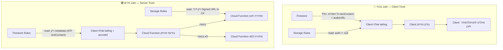

# 🔐 סקירת אבטחה — Hushhh App: לוגיקת גישה לתוכן

**תאריך**: 9 במאי 2026  
**סוג**: בדיקה בלבד — ללא שינויי קוד  
**סטטוס**: **נמצאו 8 ממצאים קריטיים, 3 בינוניים**

---

## סיכום מנהלים

הארכיטקטורה הנוכחית של Hushhh מבוססת על מודל **"Client-Trust"** — כמעט כל לוגיקת הגישה (בדיקת מיקום, סינון תוכן, מחיקה) מתבצעת **בצד הלקוח (Flutter)**, בעוד ש-**Firestore Security Rules פתוחות** ומאפשרות לכל משתמש מאומת קריאה וכתיבה ללא הגבלות. היוצא מכך הוא שמשתמש טכני עם כלים בסיסיים (Firestore REST API, SDK ישיר) יכול לעקוף את **כל** מנגנוני ההגנה.

---

## ממצא #1: תוכן הסוד זמין בפיד הראשוני (Payload Exposure)

> [!CAUTION]
> **חומרה: קריטית** — עוקף את חוקי המשחק הבסיסיים

### הבעיה
הקריאה [getNearbySecrets](file:///c:/Dev/hush-app/lib/services/secret_service.dart#L38-L69) שולפת את **כל** המסמכים מ-Firestore כולל שדות `textContent` ו-`audioURL`. מודל [Secret.fromFirestore](file:///c:/Dev/hush-app/lib/models/secret.dart#L63-L94) מפרסר את **כל** השדות ללא הבחנה.

```dart
// secret_service.dart:38-66 — שליפה ישירה של הכל מ-Firestore
final snapshot = await _secretsRef
    .where('isHidden', isEqualTo: false)
    .orderBy('createdAt', descending: true)
    .get();

// secret.dart:73-74 — textContent ו-audioURL תמיד נשלפים
textContent: data['textContent'],
audioURL: data['audioURL'],
```

### ההשלכה
- ה-"blur" וה-"lock" הם **קוסמטיים בלבד** — התוכן כבר קיים בזיכרון ה-App.
- כל משתמש מאומת יכול לקרוא ישירות מ-Firestore (באמצעות REST API או Firebase SDK) ולקבל את `textContent` ו-`audioURL` של **כל** הסודות, ללא צורך בנוכחות פיזית.
- ה-`audioURL` הוא download URL של Firebase Storage עם token — מי שמחזיק בו יכול להוריד את הקובץ מכל מקום בעולם, ללא הגבלת זמן.

### הראיה
```
// firestore.rules:18-19 — אין שום הגבלה מעבר לאימות
match /secrets/{secretId} {
  allow read, write: if request.auth != null;
}
```

---

## ממצא #2: אין בדיקת מרחק בצד השרת (No Server-Side Proximity Check)

> [!CAUTION]
> **חומרה: קריטית** — גישה לכל סוד בעולם ללא נוכחות פיזית

### הבעיה
בדיקת הקרבה של 15 מטרים ([revealRadiusMeters](file:///c:/Dev/hush-app/lib/config/constants.dart#L4)) מתבצעת **רק בצד הלקוח** ב-[SecretCard.build](file:///c:/Dev/hush-app/lib/widgets/secret_card.dart#L682-L707):

```dart
// secret_card.dart:686-698 — בדיקה מקומית בלבד
if (widget.userPosition != null) {
  distance = Geolocator.distanceBetween(...);
  isInRange = distance <= effectiveRadius;
}
```

אין **שום** בדיקת מרחק בצד שרת — לא ב-Firestore Rules ולא ב-Cloud Functions (למעט `verifyGroupUnlock` שגם הוא לא בודק מרחק — ראה ממצא #3).

### ההשלכה
- משתמש יכול לקרוא מ-Firestore ישירות ולקבל את `textContent`/`audioURL` ללא צורך להיות בקרבת 15 מטרים.
- אין צורך ב-GPS Spoofing — מספיק לעקוף את הלקוח לגמרי.

---

## ממצא #3: Group Unlock — אין אימות מרחק ואין מניעת זיוף

> [!CAUTION]
> **חומרה: קריטית** — סוד קבוצתי ניתן לפתיחה ע"י משתמש יחיד

### הבעיה
ה-Cloud Function [verifyGroupUnlock](file:///c:/Dev/hush-app/functions/src/index.ts#L412-L489) מקבלת את הקואורדינטות מהלקוח (`userLat`, `userLng`) אבל **לא מבצעת שום בדיקה עליהן**:

```typescript
// index.ts:420-428 — מקבל lat/lng אבל לא בודק מרחק מהסוד
const { secretId, userLat, userLng } = data;
// ... הקואורדינטות נשמרות ב-unlockAttempts אבל אף פעם לא מושוות לקואורדינטות הסוד
```

**בעיות ספציפיות:**

1. **אין בדיקת מרחק**: הפונקציה שומרת את ה-lat/lng של המשתמש אבל **לא משווה** אותם לקואורדינטות הסוד. משתמש יכול לשלוח כל קואורדינטה שירצה.

2. **אין מניעת זיוף מרובה**: הפונקציה משתמשת ב-`uid` כ-Document ID (`attemptsRef.doc(uid).set(...)`) — אז משתמש יחיד לא יכול ליצור מספר רשומות מאותו חשבון. **אבל** — אם לתוקף יש 3 חשבונות Google שונים, הוא יכול לשלוח 3 קריאות מ-3 tokens שונים מאותו מכשיר ולפתוח סוד קבוצתי ברמה 1 (שדורש 3 משתמשים).

3. **אין בדיקת קרבה בין המשתתפים**: גם אם היו 3 משתמשים אמיתיים, אין ולידציה שהם **פיזית באותה נקודה**. כל אחד יכול לשלוח קואורדינטות שונות לחלוטין.

### ההשלכה
- תוקף עם חשבונות מרובים יכול לפתוח כל סוד קבוצתי מכל מקום.
- אפילו ללא חשבונות מרובים — התוכן כבר נגיש ישירות מ-Firestore (ממצא #1).

---

## ממצא #4: דליפת מידע על היוצר (Creator Data Leak)

> [!WARNING]
> **חומרה: בינונית-גבוהה** — הפרת פרטיות

### הבעיה
מסמך הסוד ב-Firestore מכיל **תמיד** את:
- `creatorId` — UID של היוצר
- `creatorName` — שם מלא
- `creatorPhotoURL` — תמונת פרופיל
- `creatorTierLevel` — דרגה

נתונים אלה זמינים **לפני** חשיפת הסוד — הם מוצגים בכותרת ה-[SecretCard](file:///c:/Dev/hush-app/lib/widgets/secret_card.dart#L748-L809) גם כשהתוכן מוסתר:

```dart
// secret_card.dart:786 — השם מוצג תמיד
Text(_currentSecret.creatorName ?? 'Anonymous', ...)
```

בנוסף, מסמך `users/{userId}` נגיש לקריאה מלאה לכל משתמש מאומת ([firestore.rules:10-11](file:///c:/Dev/hush-app/firestore.rules#L10-L11)), חושף `email`, `dateOfBirth`, `gender`, `fcmToken`, ו-`savedSecretIds`.

### ההשלכה
- אימייל ופרטים אישיים של כל משתמש חשופים ל-API.
- רשימת הסודות השמורים (`savedSecretIds`) של כל משתמש נגישה לכולם.

---

## ממצא #5: סודות שמורים של משתמש חשופים (Saved Secrets Leak)

> [!WARNING]
> **חומרה: בינונית** — הפרת פרטיות

### הבעיה
שדה `savedSecretIds` במסמך המשתמש נגיש לקריאה ע"י **כל** משתמש מאומת:

```
// firestore.rules:10-11
match /users/{userId} {
  allow read, write: if request.auth != null;  // כל משתמש קורא הכל
}
```

בקוד ה-[ProfileScreen](file:///c:/Dev/hush-app/lib/screens/profile_screen.dart#L69-L72), בפרופיל של משתמש אחר (public view), הסודות השמורים **לא** מוצגים ב-UI (`isMe` check בשורה 275), אבל הנתון **כן** נקרא מ-Firestore ונשלח ל-client כי אין הגבלה ב-Rules.

### ההשלכה
- כל משתמש יכול לדעת **אילו סודות** משתמש אחר שמר.

---

## ממצא #6: מנגנון ה-Decay לא מוחק קבצי שמע מ-Storage

> [!CAUTION]
> **חומרה: קריטית** — קבצי שמע נשארים לנצח

### הבעיה
ה-[decaySecretsJob](file:///c:/Dev/hush-app/functions/src/index.ts#L99-L170) מוחק את **מסמך ה-Firestore בלבד** (`batch.delete(doc.ref)`), אבל **לא מוחק** את קובץ השמע מ-Firebase Storage:

```typescript
// index.ts:159 — מחיקה של המסמך בלבד
batch.delete(doc.ref);
// ❌ אין: admin.storage().bucket().file(`audio/${doc.id}.m4a`).delete()
```

אותה בעיה קיימת ב-[deleteSecret](file:///c:/Dev/hush-app/lib/services/secret_service.dart#L376-L386) מצד הלקוח:

```dart
// secret_service.dart:380 — מחיקה של הרשומה בלבד
await _secretsRef.doc(secretId).delete();
// ❌ אין: FirebaseStorage.instance.ref('audio/$secretId.m4a').delete()
```

### ההשלכה
- קבצי שמע של סודות "שנמחקו" נשארים ב-Storage **לנצח**.
- אם מישהו שמר את ה-`audioURL` (שהוא download URL ציבורי עם token), הוא יכול לגשת לקובץ גם אחרי שהסוד "נמחק".
- עלויות Storage ימשיכו לגדול ללא הגבלה.

---

## ממצא #7: גישה לסוד "שנמחק" דרך ה-ID שלו

> [!WARNING]
> **חומרה: בינונית** — במקרה הנוכחי לא ניצלת, אבל רלוונטית

### הבעיה
למרות ש-[getSecret](file:///c:/Dev/hush-app/lib/services/secret_service.dart#L72-L76) יחזיר `null` לאחר מחיקת המסמך, ה-`audioURL` שהיה חלק מהסוד הוא קישור ישיר ל-Storage שנשאר פעיל (ראה ממצא #6).

בנוסף, ה-[Storage Rules](file:///c:/Dev/hush-app/storage.rules#L7-L8) מאפשרות **קריאה** לכל משתמש מאומת:

```
match /audio/{allPaths=**} {
  allow read, write: if request.auth != null;
}
```

### ההשלכה
- אם תוקף יודע את ה-Secret ID (שהיה גם ה-filename ב-Storage: `audio/{secretId}.m4a`), הוא יכול לגשת לקובץ השמע ישירות מ-Storage גם אחרי מחיקת הסוד.

---

## ממצא #8: אין מניעת GPS Spoofing

> [!CAUTION]
> **חומרה: קריטית** — אבל רלוונטי רק אם ממצאים 1-2 יתוקנו

### הבעיה
המערכת מסתמכת **לחלוטין** על `Geolocator.getCurrentPosition()` ([location_provider.dart:61-84](file:///c:/Dev/hush-app/lib/providers/location_provider.dart#L61-L84)) שקורא מ-GPS API של המכשיר. אין שום ולידציה צד-שרת:

- **אין בדיקת סבירות תנועה** (Velocity check) — משתמש יכול "לקפוץ" 10,000 ק"מ בשנייה.
- **אין בדיקת accuracy** — גם אם ה-`accuracy` שה-client שולח הוא 10,000 מטרים, אין מי שבודק.
- **אין Cross-validation** — אין השוואה ל-IP geolocation, cell tower data, Wi-Fi positioning, וכו'.

### ההשלכה
- אפליקציות GPS Spoofing זמינות בחינם ל-Android (rooted ולא). ב-iOS נדרש jailbreak או כלים כמו iTools.
- **הערה חשובה**: כרגע ממצא זה **משני** מכיוון שממצאים #1 ו-#2 מאפשרים גישה מלאה לתוכן ללא צורך ב-Spoofing כלל.

---

## ממצא #9: אין Rate Limiting

> [!WARNING]
> **חומרה: בינונית** — מאפשר Enumeration/Scraping

### הבעיה
- אין rate limiting על קריאות Firestore — משתמש מאומת יכול לשלוף את **כל** הסודות בקריאה אחת.
- ה-Cloud Function `verifyGroupUnlock` לא מגבילה קצב קריאות — משתמש יכול לשלוח עשרות בקשות unlock בשנייה.
- אין throttling על פעולות `like`/`dislike`/`comment` — ניתן לבצע spam.

### ההשלכה
- ניתן לסרוק את כל תוכן האפליקציה באמצעות סקריפט פשוט.
- ניתן לבצע vote manipulation (like/dislike spam).

---

## ממצא #10: Firestore Rules — כל משתמש יכול לכתוב הכל

> [!CAUTION]
> **חומרה: קריטית** — ה-root cause של רוב הממצאים

### הבעיה
כל ה-[Firestore Rules](file:///c:/Dev/hush-app/firestore.rules#L1-L38) מבוססות על `request.auth != null` בלבד — **כל** משתמש מאומת יכול:

```
match /secrets/{secretId} {
  allow read, write: if request.auth != null;
}
match /users/{userId} {
  allow read, write: if request.auth != null;
}
```

### מה זה מאפשר:
| פעולה | השלכה |
|---|---|
| קריאת כל הסודות | גישה ל-textContent ו-audioURL ללא הגבלת מיקום |
| כתיבה לסודות של אחרים | שינוי likes/views/reportCount, הסתרת סודות (`isHidden: true`) |
| קריאת פרופילי משתמשים | חשיפת email, savedSecretIds, fcmToken |
| כתיבה לפרופילי אחרים | שינוי tierLevel, isAdmin, isGhostMode של **כל** משתמש |
| מחיקת סודות של אחרים | מחיקה ישירה מ-Firestore |
| כתיבה ל-unlockAttempts | זיוף נסיונות unlock |

### דוגמה קונקרטית:
משתמש רגיל יכול להפוך את עצמו ל-Admin:
```javascript
// ניתן לבצע מהדפדפן עם Firebase SDK
firebase.firestore().collection('users').doc(MY_UID).update({
  isAdmin: true,
  tierLevel: 10
});
```

---

## ממצא #11: Admin UID Hardcoded

> [!NOTE]
> **חומרה: נמוכה** — Information Disclosure

ב-[constants.dart:28](file:///c:/Dev/hush-app/lib/config/constants.dart#L28):
```dart
static const String adminUid = 'A30Br3OakdXF5BnfQFu5pryOsgy2';
```

ה-Admin UID חשוף בקוד ה-client (ניתן לחילוץ מה-APK). אך זה **פחות חמור** מהעובדה שכל משתמש יכול להפוך את עצמו ל-Admin (ממצא #10).

---

## סיכום חומרה

| # | ממצא | חומרה | קטגוריה |
|---|---|---|---|
| 1 | תוכן הסוד בפיד הראשוני | 🔴 קריטי | Payload |
| 2 | אין בדיקת מרחק בשרת | 🔴 קריטי | Proximity |
| 3 | Group Unlock ללא אימות מרחק | 🔴 קריטי | Group Logic |
| 4 | דליפת מידע על היוצר | 🟡 בינוני-גבוה | Privacy |
| 5 | Saved Secrets חשופים | 🟡 בינוני | Privacy |
| 6 | Decay לא מוחק מ-Storage | 🔴 קריטי | Decay |
| 7 | גישה לסוד שנמחק | 🟡 בינוני | Decay |
| 8 | אין GPS Spoofing mitigation | 🔴 קריטי* | Location |
| 9 | אין Rate Limiting | 🟡 בינוני | Rate Limit |
| 10 | Firestore Rules פתוחות | 🔴 קריטי | Root Cause |
| 11 | Admin UID Hardcoded | ⚪ נמוך | Info Disclosure |

\* חומרה קריטית רק לאחר תיקון ממצאים 1-2

---

## 📊 ארכיטקטורה נוכחית vs. ארכיטקטורה נדרשת



---

> [!IMPORTANT]
> ## המלצה מרכזית
> 
> הפער הארכיטקטוני הוא **מבני** — לא מדובר בבאג נקודתי אלא במודל אבטחה שמסתמך על הלקוח. התיקון דורש **הזזת לוגיקת הגישה לצד השרת** באמצעות Cloud Functions שמתווכות בין הלקוח לבין Firestore/Storage.
> 
> **ללא שינוי ארכיטקטוני, כל משתמש מאומת עם ידע טכני בסיסי יכול לגשת לכל התוכן באפליקציה ללא הגבלות פיזיות או חברתיות.**
